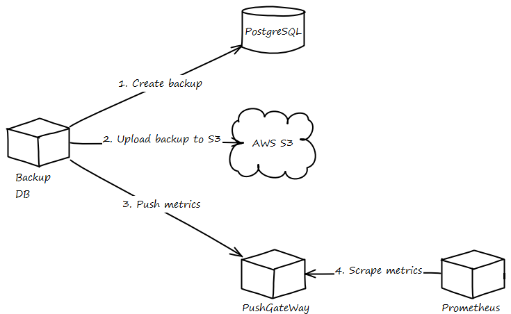

# Backup DB
Backup DB is a docker for create database backup (PostgreSQL)
and uploads to AWS S3. Also sends metrics a Prometheus through
PushGateWay.

# Variables
|          Name         	|          Description          	|      Default      	|
|:---------------------:	|:-----------------------------:	|:-----------------:	|
| POSTGRES_USER         	| Database username             	| postgres          	|
| POSTGRES_PASSWORD     	| Database password             	| password          	|
| POSTGRES_HOSTNAME     	| Database hostname             	| postgresql        	|
| POSTGRES_DUMP_PATH    	| Temporal path                 	| /tmp/backup       	|
| BUCKET_BACKUP_DB      	| Bucket name for upload backup 	|                   	|
| AWS_ACCESS_KEY_ID     	| Credentials AWS               	|                   	|
| AWS_SECRET_ACCESS_KEY 	| Credentials AWS               	|                   	|
| AWS_DEFAULT_REGION    	| Region AWS                    	| eu-west-1         	|
| PUSHGATEWAY_HOST      	| PushGateWay hostname          	| pushgateway:9091  	|
| PUSHGATEWAY_JOB       	| PushGateWay job name          	| POSTGRES_HOSTNAME 	|
| GZIP                      | Compression ratio                 | -9                    |

# Metrics
|                           Name                           	|                        Description                       	|
|:--------------------------------------------------------:	|:--------------------------------------------------------:	|
| backup_db{label="redmic"}                                	| Outcome of the backup database job (0=failed, 1=success) 	|
| backup_duration_seconds{label="redmic",stage="dump"}     	| Duration of create dump execution in seconds             	|
| backup_duration_seconds{label="redmic",stage="compress"} 	| Duration of compress dump execution in seconds           	|
| backup_duration_seconds{label="redmic",stage="upload"}   	| Duration of upload backup to S3 execution in seconds     	|
| backup_size_bytes{label="redmic"}                        	| Duration of the script execution in seconds              	|
| backup_created_date_seconds{label="redmic"}              	| Created date in seconds                                  	|